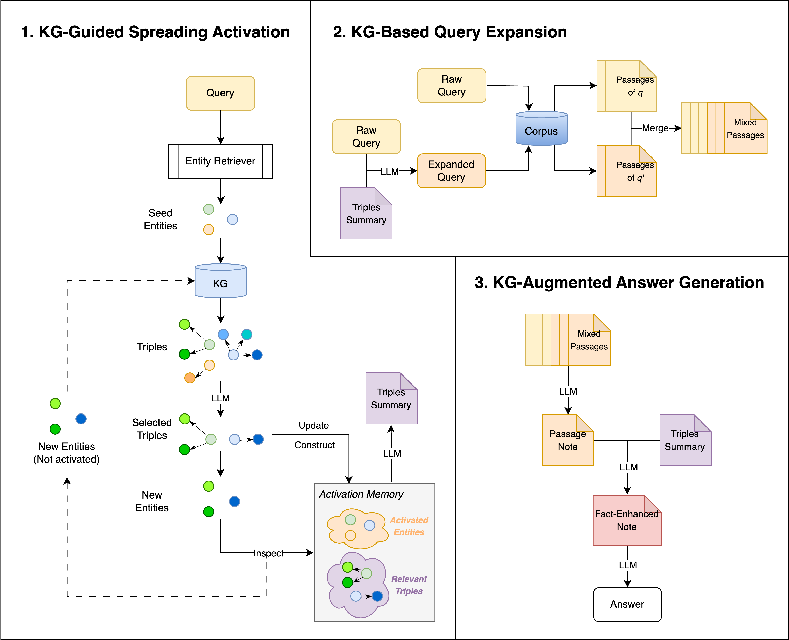
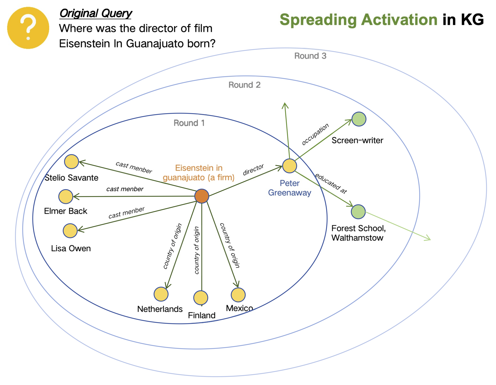

We are currently organizing the code.

# KG-Infused RAG

We propose <b>KG-Infused RAG</b>, a framework that integrates KGs into RAG systems to implement 🧠<i>spreading activation</i>, a cognitive process that enables concept association and inference.

  

Below is an example illustrating **the accumulated subgraph constructed through KG-guided spreading activation**. Due to space limitations, only a portion of the subgraph is shown, and some activated entities are omitted.

  

